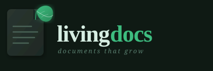

<p align="center">
  <picture>
    <source media="(prefers-color-scheme: dark)" srcset="assets/logo.svg">
    
  </picture>
</p>

<p align="center">
  <a href="https://www.nuget.org/packages/LivingDocs.Mcp"></a>
  <a href="https://www.nuget.org/packages/LivingDocs.Mcp"></a>
  <a href="https://github.com/dinesh-mys/livingdocs/issues"></a>
  <a href="https://github.com/dinesh-mys/livingdocs/discussions"></a>
  <a href="LICENSE"></a>
</p>

<p align="center">
  AI-powered documentation health monitor. Detects stale code comments, finds knowledge gaps, alerts on departure risk, and ingests Slack, Teams, and email conversations — so your entire org's knowledge stays searchable and current.
</p>


## Install

Requires [.NET 10 SDK](https://dotnet.microsoft.com/download).

```bash
dotnet tool install -g LivingDocs.Mcp
```

## Tools

| Tool | Tier | Description |
|------|------|-------------|
| `scan_repo` | Free | Scan a repo and list stale doc files with staleness % (0–100%) |
| `query_docs` | Free | Answer natural-language questions about your codebase using its doc comments |
| `index_repo` | Free | Build or refresh the semantic search index for a repository |
| `suggest_doc_update` | Free | Ask Claude to rewrite a stale doc comment |
| `write_back` | Free | Write Claude-generated doc updates directly to source files |
| `detect_gaps` | Free | Find files with zero documentation, ranked by commit activity |
| `departure_risk` | Free | Identify authors who are the sole contributor to critical files (bus factor) |
| `write_docs` | Pro | Write updated docs to `docs/<File>.md` with a UTC timestamp — full audit trail |
| `sync_confluence` | Pro | Write updated docs back to Confluence pages |
| `scan_org` | Pro | Scan all repos in a GitHub org and return an org-wide report |
| `index_slack` | Pro | Index a Slack channel into the knowledge base — searchable via `query_docs` |
| `index_teams` | Pro | Index a Microsoft Teams channel into the knowledge base |
| `index_email` | Pro | Index an IMAP email folder into the knowledge base |

## Quick test

```bash
livingdocs-mcp scan /path/to/your/repo
```

```
Scanning /path/to/repo ...
Files examined : 12
Stale docs     : 2

  [██████████]  100%  src/Tax.cs
               doc updated : 2024-09-01
               code changed: 2025-01-15

  [████░░░░░░]   40%  src/Auth.cs
               doc updated : 2024-12-01
               code changed: 2025-01-28
```

---

## Setup — Claude Desktop

Edit `~/Library/Application Support/Claude/claude_desktop_config.json`:

```json
{
  "mcpServers": {
    "livingdocs": {
      "command": "livingdocs-mcp",
      "env": {
        "ANTHROPIC_API_KEY": "sk-ant-..."
      }
    }
  }
}
```

Restart Claude Desktop. The tools will appear under the **+** menu.

---

## Setup — Claude Code

Add a `.mcp.json` file to your project root:

```json
{
  "mcpServers": {
    "livingdocs": {
      "command": "livingdocs-mcp",
      "env": {
        "ANTHROPIC_API_KEY": "sk-ant-..."
      }
    }
  }
}
```

Or register globally:

```bash
claude mcp add livingdocs -s user -- livingdocs-mcp
```

Then in Claude Code chat:

```
scan this repo for stale docs              → uses scan_repo
what does the Auth module do?              → uses query_docs
suggest a fix for src/Tax.cs              → uses suggest_doc_update
find undocumented files                   → uses detect_gaps
who owns the payments module?             → uses departure_risk
```

---

## Setup — GitHub Copilot (VS Code)

VS Code 1.99+ supports MCP servers in Copilot agent mode. Add a `.vscode/mcp.json` file to your project:

```json
{
  "servers": {
    "livingdocs": {
      "type": "stdio",
      "command": "livingdocs-mcp",
      "env": {
        "ANTHROPIC_API_KEY": "sk-ant-..."
      }
    }
  }
}
```

Open the Copilot chat panel, switch to **Agent mode**, and the tools will be available.

> **Note:** The `@livingdocs` Copilot Extension agent is built and deployed but pending GitHub Copilot plan availability for agent URL registration. The MCP server path above works fully in the meantime.

---

## Setup — GitHub Webhook

The webhook integration watches every PR merge in your repo and automatically posts a stale-doc report as a PR comment. Optionally sends a Slack notification with an **Auto-draft** button that generates doc fixes in one click.

### 1. Deploy LivingDocs.CopilotExt

The webhook handler runs as a web service. Deploy it to any host (Railway, Fly.io, a VPS):

```bash
# Docker
docker build -t livingdocs-ext .
docker run -p 8080:8080 \
  -e ANTHROPIC_API_KEY=sk-ant-... \
  -e GITHUB_WEBHOOK_SECRET=your-secret \
  -e LIVINGDOCS_REPO_PATH=/path/to/local/repo \
  livingdocs-ext
```

### 2. Register the webhook in GitHub

Go to your repository → **Settings → Webhooks → Add webhook**:

| Field | Value |
|-------|-------|
| **Payload URL** | `https://your-server/api/github/webhook` |
| **Content type** | `application/json` |
| **Secret** | Any random string — set as `GITHUB_WEBHOOK_SECRET` |
| **Events** | Select individual events → check **Pull requests** only |

### 3. Set required environment variables

| Variable | Required | Description |
|----------|----------|-------------|
| `GITHUB_WEBHOOK_SECRET` | Yes | Must match the secret entered in GitHub |
| `LIVINGDOCS_REPO_PATH` | Yes | Absolute path to the local clone of the repository |
| `GITHUB_TOKEN` | Recommended | PAT with `repo` scope — needed to post PR comments and fetch diffs |
| `ANTHROPIC_API_KEY` | Yes | For AI impact analysis and semantic doc mapping |
| `SLACK_WEBHOOK_URL` | Optional | Incoming webhook URL for Slack stale-doc alerts |
| `SLACK_SIGNING_SECRET` | Optional | Enables the **Auto-draft** Slack button (Slack App → Basic Information) |

### 4. What happens on each merged PR

1. GitHub sends a `pull_request` event with `action: closed, merged: true`
2. LivingDocs validates the HMAC-SHA256 signature
3. Fetches changed files from the GitHub API
4. Runs stale-doc detection against the local repo
5. Calls Claude to analyse the diff and map affected `.md` docs
6. Posts a report as a PR comment
7. Sends a Slack notification (if configured) with an **Auto-draft top doc** button

---

## Pro tier

**7-day free trial available** — no credit card required to start.

Pro tools require a license key:

```bash
export LIVINGDOCS_LICENSE_KEY=LD-xxxx-xxxx-xxxx
```

Or add it to the `env` block in your MCP config:

```json
{
  "mcpServers": {
    "livingdocs": {
      "command": "livingdocs-mcp",
      "env": {
        "ANTHROPIC_API_KEY": "sk-ant-...",
        "LIVINGDOCS_LICENSE_KEY": "LD-xxxx-xxxx-xxxx"
      }
    }
  }
}
```

Start a **[7-day free trial — LivingDocs Pro](https://buy.polar.sh/polar_cl_LcRKdosjt3TwpUkKBSoDOPOP6ea6ArOfKpyB91MSdiM)** (then $10/month).

---

## Free tool — detect_gaps

Finds source files that have **zero documentation comments** and ranks them by commit activity. The busiest undocumented files are the highest-priority knowledge gaps — code that changes frequently but is never explained.

**Usage in Claude:**
```
detect_gaps on /path/to/repo
```

**Example output:**
```
Knowledge gaps in '/path/to/repo'
Files scanned: 42  |  Documented: 28  |  Undocumented: 14 (33%)

Top undocumented files by activity:
  src/payments/retry.ts          42 commits    last changed 2024-11-03  by Alice
  src/auth/session.ts            31 commits    last changed 2025-01-08  by Bob

To add docs to the highest-priority file, run:
  suggest_doc_update on /path/to/repo src/payments/retry.ts
```

---

## Free tool — departure_risk

Identifies authors who are the **sole or dominant contributor** to critical files — the classic "bus factor 1" problem. Files where one person accounts for ≥60% of commits and has ≥5 total commits are flagged as single points of knowledge.

**Usage in Claude:**
```
departure_risk on /path/to/repo
```

**Example output:**
```
Departure risk analysis for '/path/to/repo'
Files analysed: 42  |  High-risk files: 8

Authors with exclusive knowledge:

  Alice Chen  (6 files)
    • src/auth/session.ts        12 commits  (83% by Alice Chen)
    • src/payments/retry.ts       9 commits  (75% by Alice Chen)

  Bob Smith  (2 files)
    • src/core/engine.go         22 commits  (91% by Bob Smith)

To generate a handover doc for the riskiest file:
  suggest_doc_update on /path/to/repo src/auth/session.ts
```

---

## Pro tool — write_docs

Detects stale doc comments in a file, generates updated documentation via Claude, and appends the results to `docs/<FileName>.md` inside your repository — with a UTC timestamp on every run. Each run adds a new dated section, building a full audit trail of how your documentation evolved over time.

**Usage in Claude:**
```
write_docs on /path/to/repo for src/Tax.cs
```

Creates or appends to `docs/Tax.md`:
```markdown
# Tax.cs — LivingDocs Documentation

<!-- LivingDocs update: 2026-05-19 10:32 UTC | src/Tax.cs -->
## 2026-05-19

### TaxCalculator.Calculate
Calculates net tax payable given gross income, deductions, and the current financial year slab rates...

*Confidence: 92%*

---
```

---

## Pro tool — sync_confluence

Detects stale doc comments in a file, generates updated documentation via Claude, and writes the results to the matching Confluence page (creates it if it doesn't exist).

**Required env vars:**

| Variable | Description |
|----------|-------------|
| `CONFLUENCE_BASE_URL` | Your Confluence Cloud URL, e.g. `https://mycompany.atlassian.net/wiki` |
| `CONFLUENCE_EMAIL` | Atlassian account email |
| `CONFLUENCE_API_TOKEN` | API token from [id.atlassian.com/manage-profile/security/api-tokens](https://id.atlassian.com/manage-profile/security/api-tokens) |
| `CONFLUENCE_SPACE_KEY` | Target space key, e.g. `DEV` (visible in the space URL) |

**Usage in Claude:**
```
sync_confluence on /path/to/repo for src/Tax.cs
```

---

## Pro tool — scan_org

Scans every repository in a GitHub organisation and returns an org-wide staleness report. Shallow-clones each repo, runs stale-doc detection, then cleans up.

**Required env vars:**

| Variable | Description |
|----------|-------------|
| `GITHUB_TOKEN` | Personal access token with `repo` and `read:org` scopes |

**Usage in Claude:**
```
scan_org on my-company
```

**Example output:**
```
Org: my-company — 8 repos scanned | 142 files | 5 stale docs

⚠️ Repos with stale docs
api-service — 3 stale / 48 files
  - src/Auth.cs (100%)
  - src/Tax.cs (80%)

✅ Clean repos (6)
frontend, user-service, admin-api, ...
```

---

## Pro tool — index_slack

Fetches messages from a Slack channel and adds them to the repository's knowledge index. Once indexed, `query_docs` returns results from Slack discussions **alongside code documentation** — so "why did we choose Postgres?" finds both code comments and the Slack thread where the decision was made.

Threads are grouped so context is preserved. Bot messages, join/leave events, and messages under 30 characters are filtered out automatically.

**Required env vars:**

| Variable | Description |
|----------|-------------|
| `SLACK_BOT_TOKEN` | Bot token (`xoxb-...`) — Slack App → OAuth & Permissions |

**Bot OAuth scopes required:** `channels:history`, `channels:read`

**Usage in Claude:**
```
index_slack on /path/to/repo C1234ABCD
```

Then query across code + Slack:
```
query_docs on /path/to/repo "how does the auth flow work?"
```

---

## Pro tool — index_teams

Fetches messages from a Microsoft Teams channel via the Graph API and adds them to the knowledge index. Uses client credentials OAuth — no user sign-in required.

**Required env vars:**

| Variable | Description |
|----------|-------------|
| `TEAMS_TENANT_ID` | Azure AD tenant ID |
| `TEAMS_CLIENT_ID` | Azure AD app (client) ID |
| `TEAMS_CLIENT_SECRET` | Azure AD client secret |

**Azure AD app setup:**
1. Register an app in [Azure portal](https://portal.azure.com) → App registrations
2. Add application permission: `ChannelMessage.Read.All`
3. Grant admin consent
4. Create a client secret
5. Get team/channel IDs from [Graph Explorer](https://developer.microsoft.com/graph/graph-explorer)

**Usage in Claude:**
```
index_teams on /path/to/repo <teamId> <channelId>
```

---

## Pro tool — index_email

Fetches emails from an IMAP mailbox folder and adds them to the knowledge index. Engineering discussions, incident reports, and architectural decisions in email become searchable alongside code documentation. Email quoting (`>` lines) is stripped automatically.

Works with Gmail app passwords, Microsoft 365, and any standard IMAP provider.

**Required env vars:**

| Variable | Description |
|----------|-------------|
| `IMAP_HOST` | IMAP server hostname, e.g. `imap.gmail.com` |
| `IMAP_USERNAME` | Email address |
| `IMAP_PASSWORD` | Password or app password |
| `IMAP_PORT` | Port (default `993`) |

**Gmail setup:** Use an [App Password](https://myaccount.google.com/apppasswords) — not your account password. Requires 2-Step Verification.

**Usage in Claude:**
```
index_email on /path/to/repo folder=Engineering
```

For best results, create a dedicated folder (e.g. `Engineering/Architecture`) and filter relevant emails into it.

---

## Enterprise tier

Enterprise licenses run fully offline — no internet required for license validation. Ideal for air-gapped environments and regulated industries.

**How it works:**
1. Contact **[dinesh@novaders.com](mailto:dinesh@novaders.com?subject=LivingDocs Enterprise)** with your company name and team size
2. Receive a signed JWT license key and invoice
3. Set `LIVINGDOCS_LICENSE_KEY=<jwt>` — validation happens locally, no external API calls

**Enterprise features:**
- Offline JWT license validation (RSA-256 signed — works in air-gapped networks)
- Azure OpenAI support — use your own Azure deployment instead of Anthropic
- Self-contained binary — no .NET SDK required, download from [GitHub Releases](https://github.com/dinesh-mys/livingdocs/releases)
- Priority support and custom invoicing (annual or one-time)

**Azure OpenAI setup:**

```json
{
  "mcpServers": {
    "livingdocs": {
      "command": "livingdocs-mcp",
      "env": {
        "LIVINGDOCS_LICENSE_KEY": "<enterprise-jwt>",
        "AZURE_OPENAI_ENDPOINT": "https://your-resource.openai.azure.com",
        "AZURE_OPENAI_API_KEY": "your-azure-key",
        "AZURE_OPENAI_DEPLOYMENT": "gpt-4o"
      }
    }
  }
}
```

---

## Environment variables

| Variable | Required | Description |
|----------|----------|-------------|
| `ANTHROPIC_API_KEY` | Yes (AI features) | Anthropic API key — not needed if using Azure OpenAI |
| `LIVINGDOCS_LICENSE_KEY` | Yes (Pro/Enterprise) | `LD-xxxx` key from [Polar.sh](https://buy.polar.sh/polar_cl_LcRKdosjt3TwpUkKBSoDOPOP6ea6ArOfKpyB91MSdiM) or JWT from Novaders LLP |
| `AZURE_OPENAI_ENDPOINT` | Enterprise | Azure OpenAI resource endpoint |
| `AZURE_OPENAI_API_KEY` | Enterprise | Azure OpenAI API key |
| `AZURE_OPENAI_DEPLOYMENT` | Enterprise | Azure OpenAI deployment name, e.g. `gpt-4o` |
| `GITHUB_TOKEN` | Recommended | PAT with `repo` + `read:org` scopes — for `scan_org`, PR comments, and private repos |
| `GITHUB_WEBHOOK_SECRET` | Webhook | HMAC secret — must match the secret set in GitHub repo webhook settings |
| `LIVINGDOCS_REPO_PATH` | Webhook | Absolute path to the local repo clone for the webhook handler to scan |
| `CONFLUENCE_BASE_URL` | `sync_confluence` | Confluence Cloud URL, e.g. `https://mycompany.atlassian.net/wiki` |
| `CONFLUENCE_EMAIL` | `sync_confluence` | Atlassian account email |
| `CONFLUENCE_API_TOKEN` | `sync_confluence` | Atlassian API token |
| `CONFLUENCE_SPACE_KEY` | `sync_confluence` | Confluence space key, e.g. `DEV` |
| `SLACK_WEBHOOK_URL` | Optional | Incoming webhook URL for stale-doc Slack alerts after PR merges |
| `SLACK_SIGNING_SECRET` | Optional | Enables the Auto-draft button in Slack notifications (Slack App → Basic Information) |
| `SLACK_BOT_TOKEN` | `index_slack` | Bot token (`xoxb-...`) with `channels:history` + `channels:read` scopes |
| `TEAMS_TENANT_ID` | `index_teams` | Azure AD tenant ID |
| `TEAMS_CLIENT_ID` | `index_teams` | Azure AD app (client) ID |
| `TEAMS_CLIENT_SECRET` | `index_teams` | Azure AD client secret |
| `IMAP_HOST` | `index_email` | IMAP server hostname, e.g. `imap.gmail.com` |
| `IMAP_USERNAME` | `index_email` | Email address / IMAP login |
| `IMAP_PASSWORD` | `index_email` | Password or app password |
| `IMAP_PORT` | `index_email` | IMAP port — defaults to `993` (SSL) |

## Supported languages

C#, TypeScript, JavaScript, Python, Go

## Build from source

```bash
git clone https://github.com/dinesh-mys/livingdocs
cd livingdocs
make build
make test
make scan REPO=/path/to/your/repo
```

## Architecture

```
┌──────────────────────────────────────────────────────────────┐
│                        Interfaces                             │
│  Claude Desktop │ Claude Code │ VS Copilot │ GitHub Webhook  │
└───────┬──────────────────────────────────────┬───────────────┘
        │                                      │
   livingdocs-mcp                    LivingDocs.CopilotExt
   (MCP server)                      /api/github/webhook
        │                            /api/slack/actions
        │                            /api/copilot/chat (SSE)
        └──────────────────┬─────────┘
                    LivingDocs.Core
   ┌────────────────────────┴────────────────────────────────┐
GitScanner  DocExtractor  StaleDocDetector  ClaudeService
GapDetector  DepartureRisk  IndexService  DocWriterService
SlackConnector  TeamsConnector  EmailConnector  ConfluenceService
```

## Projects

| Project | Purpose |
|---------|---------|
| `LivingDocs.Core` | Shared engine — git scanning, doc extraction, stale detection, Claude API, knowledge gap + departure risk analysis, Slack/Teams/Email connectors, Confluence sync, org scanning |
| `LivingDocs.McpServer` | CLI + MCP server — published as `LivingDocs.Mcp` on NuGet |
| `LivingDocs.CopilotExt` | GitHub webhook handler, Slack notifications + approval flow, Copilot Extension SSE endpoint |
| `LivingDocs.Tests` | xUnit test suite (94 tests) |

## Feedback & Support

- **Bug reports** → [GitHub Issues](https://github.com/dinesh-mys/livingdocs/issues/new?template=bug_report.md)
- **Feature requests** → [GitHub Issues](https://github.com/dinesh-mys/livingdocs/issues/new?template=feature_request.md)
- **Questions & ideas** → [GitHub Discussions](https://github.com/dinesh-mys/livingdocs/discussions)

## License

MIT — see [LICENSE](LICENSE).
